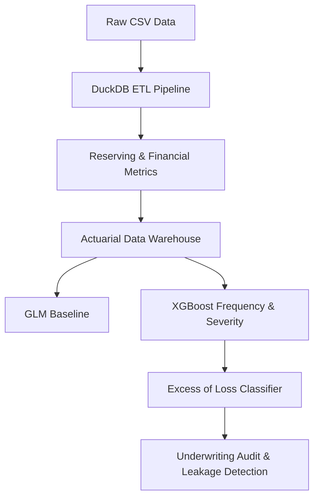

# Reinsurance Analytics

## Overview
This repository contains an end-to-end data engineering and predictive analytics pipeline designed for Property & Casualty (P&C) Reinsurance Finance. The project demonstrates how to transition from traditional actuarial pricing to an advanced machine learning architecture, focusing on portfolio profitability, tail-risk identification, and underwriting leakage.

The objective is to automate the extraction of actionable business insights from raw insurance data, simulating the infrastructure of a modern Reinsurance Finance department.

## Architecture & Workflow

The pipeline is structured into two core operational phases:

1. **Data Engineering (ETL):** Processing raw exposure and claims data into a local relational data warehouse using DuckDB.
2. **Predictive Analytics:** Benchmarking traditional Generalized Linear Models (GLMs) against non-linear XGBoost algorithms to model Frequency, Severity, and Reinsurance Tail-Risk.



## Core Components

### Phase 1: Data Engineering
- **Data Ingestion & Transformation:** Handles large-scale P&C datasets (freMTPL2 exposure and severity) utilizing DuckDB for out-of-memory processing.
- **Claims Reserving Simulation:** Applies stochastic simulations to generate Reporting Delays and Payment Delays, structuring claims into Paid, Case Reserves, and IBNR (Incurred But Not Reported) buckets.
- **Financial Reporting Mart:** Computes standard P&C Key Performance Indicators, including Loss Ratio, Expense Ratio, and Combined Ratio, while simulating a Quota Share Reinsurance Treaty structure.

### Phase 2: Risk Analytics
- **Actuarial Baseline (GLM):** Establishes a multiplicative tariff benchmark using Poisson (Frequency) and Gamma (Severity) regressions, incorporating Exposure as a mathematical offset.
- **Pure Premium ML Engine:** Implements XGBoost models to capture non-linear risk interactions, calculating the Expected Pure Premium for each policy.
- **Reinsurance Tail-Risk (XoL):** Trains an imbalanced classification model to predict the probability of a policy triggering an Excess of Loss (XoL) treaty threshold (95th percentile of claim costs).
- **Underwriting Audit & Leakage:** Uses Permutation Importance for robust risk-driver explainability and executes SQL profiling to isolate "Toxic Clusters" (segments where the Technical Loss Ratio heavily exceeds commercial premiums).

## Technology Stack
- **Database / ETL:** DuckDB, SQL
- **Data Manipulation:** Python, Pandas, NumPy
- **Actuarial & ML Modeling:** Statsmodels (GLM), XGBoost, Scikit-Learn
- **Visualization:** Matplotlib

## How to Reproduce

To run the pipeline locally and generate the analytical database and audit reports:

1. Clone the repository and navigate to the project directory.
2. Install the required dependencies:
   ```bash
   pip install -r requirements.txt
   ```
3. Execute the main orchestrator script:
   ```bash
   python main.py
   ```
This will automatically process the raw data, build the DuckDB relational schema, train the baseline and ML models, and output the underwriting audit metrics.

